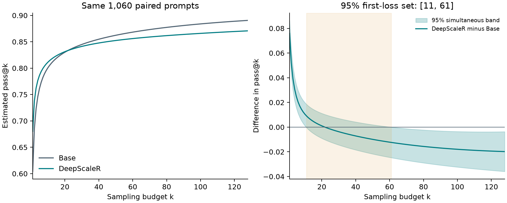

# passk-inference

**Do small-budget gains after RL persist at larger sampling budgets?**
Compare the same prompts across base and RL checkpoints with a simultaneous
confidence band over the sampling-budget grid. Identify supported gains,
supported losses, and a confidence set for the first loss budget.

[Paper](https://arxiv.org/abs/2609.22547v1) · [Code and API](docs/API.md) · [Real example](examples/deepscaler32k/README.md)

This is a tool for comparing checkpoints and sampling budgets on a specified
task population and decoding setup. It does not measure general capability or
include uncertainty across independent training runs.



## Run the paper example on a laptop

With Python 3.10 or later:

```bash
git clone https://github.com/cafferychen777/passk-inference.git
cd passk-inference
python -m venv .venv
source .venv/bin/activate  # Windows: .venv\Scripts\activate
python -m pip install '.[example]'
python examples/deepscaler32k/reproduce.py
```

No GPU, model download, cluster account, or new generation is needed. The input
contains **real sampled counts** for 1,060 paired prompts. The command checks data
hashes, recomputes the analysis, checks the paper result, and writes
`output/deepscaler32k/{result.json,curves.csv,comparison.png}`.

| Budget k | Evidence from the 95% simultaneous band |
|---|---|
| 1–10 | RL improves pass@k |
| 11–60 | Evidence is insufficient to determine the sign |
| 61–128 | RL reduces pass@k |

The first-loss confidence set is **[11, 61]**. It is not a precise crossover
point or a universal deployment threshold. This is the paper's **post hoc dense
grid analysis**; the original sparse-grid test and its p-value are distinct.
See [data provenance and paper mapping](docs/PAPER.md).

## Use your own counts

Provide two JSONL files. Each row has a unique prompt ID, integer successes `c`,
and integer trials `n`, for example `{"id":"problem-1","c":5,"n":128}`.
Both files must contain exactly the same IDs; row order does not matter.

```bash
python -m pip install '.[report]'
passk-inference --base base.jsonl --rl rl.jsonl --output output/my-comparison
```

This writes `result.json`, `curves.csv` and `comparison.png`, using the same
report implementation as the paper example. `--base-label` and `--rl-label`
set figure labels. Files with these names in the output directory are replaced.
JSON is also printed to stdout; without `--output`, the CLI remains JSON-only
and does not require Matplotlib:

```bash
passk-inference --base base.jsonl --rl rl.jsonl --bootstrap 4000 --seed 0 > result.json
```

Every result records the package version, result format version and analysis
settings. File-based comparisons also record SHA-256 hashes of the exact input
bytes consumed, by base/RL role, without local paths. See the
[result contract](docs/API.md#results-and-provenance).

By default, the grid is every integer from 1 through the smallest trial count.
Differences are **RL minus base**. Output includes both curves, the simultaneous
band, supported gain/loss budgets, inconclusive budgets, and the first-loss set.
Supplying a sparse `--ks` grid disables the all-integer first-loss interval.
The procedure assumes independent prompt rows and the sampling assumptions in
the [API reference](docs/API.md). Insufficient evidence is not equivalence.

The eight-prompt files `examples/base.jsonl` and `examples/rl.jsonl` are
**synthetic teaching data**, separate from the real example above.
The optional response-kernel API is a working model for prediction; it is not
needed for the model-free paper result.

## Check statistical behavior under known truths

The [synthetic coverage example](examples/coverage/README.md) varies prompt
count, rare success and heterogeneity, and reports whole-grid coverage, crossing
power or false detection, and Monte Carlo intervals. It is independent of the
real-data example and is not run on every CI build:

```bash
python examples/coverage/simulate.py
```

## Development and release

```bash
python -m pip install -e '.[test,example]' build
python -m pytest
python -m build
python scripts/check_sdist.py dist/passk_inference-0.3.0.tar.gz
python scripts/export_release.py
```

[Repository layout and publication policy](docs/RELEASING.md) explains what is
included, what stays private, and how to create a versioned release. Code and
original aggregate-count artifacts are under the [MIT license](LICENSE);
third-party benchmark text and model weights are not redistributed.
