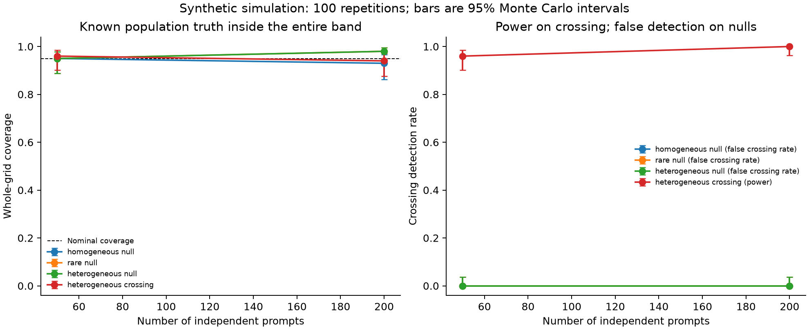

# Simultaneous coverage and crossing detection: a synthetic CPU experiment

This example checks repeated-sampling behavior under known population truths.
It is separate from the real DeepScaleR example and from unit tests. It does
not certify coverage for arbitrary task distributions or replace the paper's
empirical evidence. Small samples and rare successes can expose poor calibration.

From the repository root:

```bash
python -m pip install '.[report]'
python examples/coverage/simulate.py
```

The default runs four scenarios at 50 and 200 prompts, with 100 independent
repetitions per cell, 64 generations per checkpoint per prompt, budgets 1–32,
399 Gaussian multiplier draws and alpha=.05. It writes `simulation.json`,
`summary.csv` and `coverage.png` to `output/coverage/`. This simulation is not
part of the CI workflow. For a smoke run use `--repetitions 5 --bootstrap 99`;
for more precise Monte Carlo estimates increase both, for example:

```bash
python examples/coverage/simulate.py --prompts 50 200 800 \
  --repetitions 1000 --bootstrap 4000 --output output/coverage-long
```

The larger run takes substantially longer. The default is an illustration, not
an assertion that the true coverage equals 95%. With 100 repetitions a coverage
estimate near .95 has a Monte Carlo standard error of about .022. Error bars are
95% binomial Wilson intervals across simulation repetitions, not the pass@k
confidence band; these intervals are per cell, not simultaneous across scenarios. The default also has finite-bootstrap approximation error.

## Population, pairing and exact truth

Each repetition draws a fresh iid sample of prompt types from a finite mixture.
Each type has base and RL success probabilities `(p, q)`. Independent binomial
counts are sampled for the two checkpoints conditional on that same type;
the paired prompt effect is retained. The target is the **population** mixture
mean, not the mean conditional on the types drawn in a particular repetition:

`D(k) = sum_j weight_j * ((1 - p_j)^k - (1 - q_j)^k)`.

| Scenario | Weights | Base p | RL q | Purpose |
|---|---|---|---|---|
| Homogeneous null | 1 | .1 | .1 | Ordinary non-crossing reference |
| Rare null | 1 | .001 | .001 | Few successes and zero-variance columns |
| Heterogeneous null | .5, .5 | .001, .4 | .001, .4 | Varying prompt difficulty without model effect |
| Heterogeneous crossing | .7, .3 | .15, .02 | .3, .0002 | Gains on common types and losses on hard types |

For each repetition the exact same `compare` API used by the CLI computes the
band. Data and bootstrap have independent, reproducible random streams. Changing
cell order does not change the draws for a cell. The output records the full
scenario definitions, exact truth curves, package version and simulation settings.

## What is measured

- **Simultaneous coverage:** the true D(k) lies within the band at every budget
  in the declared grid, not merely at a selected point.
- **Crossing power:** the frequency of declaring an early gain and later loss
  when the population curve actually has both signs in that order on the grid.
- **False crossing rate:** the same declaration frequency under a non-crossing
  population. This is not the paper's separate dominance-test p-value.
- **First-loss set coverage:** the true first negative integer budget on the grid
  is inside the returned set. No loss on the grid is treated as right-censored
  beyond K, not as evidence that loss never occurs.
- **Degenerate repetition fraction:** any column has effectively zero empirical
  variance. The public API's conservative [-1,1] replacement is used unchanged;
  coverage from such bands does not imply useful precision or power.

These scenarios assume iid prompts, conditionally iid generations and fixed
checkpoints. They do not model dependent prompt clusters, adaptive selection,
verifier errors or training-seed uncertainty. A low empirical coverage should
be reported, not hidden by changing the seed or discarding that cell.


## Checked default run



[`reference.json`](reference.json) contains the completed default run (software
0.3.0, seed 2026), including the full settings and exact population curves.
The eight empirical coverage estimates range from .93 to .98; with only 100
repetitions these do not establish exact nominal coverage. In this particular
crossing scenario, detection was 96/100 at 50 prompts and 100/100 at 200 prompts.
No false crossing was observed in the null cells, but 0/100 still has a Wilson
95% upper limit of about .037. Neither perfect power nor zero false-positive
probability follows from these finite simulation counts. The script recomputes
results and never reads this saved reference.
